# 静态单赋值形式（1）

视频地址：[Bilibili](https://space.bilibili.com/1535266/video)

静态单赋值形式（Static Single Assignment Form, SSA Form），是一种IR的形式，在《[编译器设计（第2版）](https://book.douban.com/subject/20436488/)》[1]中有比较好的描述，在《Static Single Assignment Book》[4]中对应用和扩展SSA有更加多的有关内容。

虽然名字很长一串，但是实际上的意思就是说每个变量只能被赋值一次，每次赋值需要产生一个新的名字，也就是说下面的代码**Code 1**为了满足这个要求并且保持原有的语义就需要修改为**Code 2**的样子。
$$
\begin{align*}
&a\gets1 \\
&b\gets a+5 \\
&a\gets2 \\
&c\gets a+3
\end{align*}
$$

<center><b>Code 1</b></center>

$$
\begin{align*}
&a_1\gets1 \\
&b_1\gets a_1+5 \\
&a_2\gets2 \\
&c_1\gets a_2+3
\end{align*}
$$

<center><b>Code 2</b></center>


这样一来就相当于给了每个赋值一个名字，这样$a_1、a_2、a_3$这些可以被称作$a$的一个版本，这样一来对于$a$的一个使用是在哪里被定值的就可以十分清楚了，可以让很多优化变得简单。

那么如果是类似于**Code 3(a)**这样的CFG该怎么办呢？在对$B1$、$B2$的$a$进行重命名之后会产生类似于**Code 3(b)**这样的结果。

<div style="display:flex; flex-direction:row; justify-content:space-around">
	<div>
		
		<center><b>(a)</b></center>
	</div>
	<div>
		
		<center><b>(b)</b></center>
	</div>
</div>

<div><center><b>Code 3</b></center></div>


那么在$B3$中的$a$到底该引用谁是$a_1$还是$a_2$？这个时候可以定义一个叫做$\phi$函数（phi function）的特殊指令，如**Code 4**中在$B3$的入口处插入了一条$\phi$函数，其中新定义了a的新的version，$a_3$，在随后对$a$的使用被改写为使用$a_3$。


<center><b>Code 4</b></center>

加入了$\phi$函数的基本块有几个前驱，$\phi$函数就有几个参数，每个参数对应了一个前驱，如果是从第一条边到达的基本块$B$，那么$\phi$函数返回第一个参数，如果是从第二条边到达了基本块$B$，那么$\phi$函数返回第二个参数，以此类推。

当然，事实上在计算机中找不到可以对应$\phi$函数的指令，所以需要在完成了优化之后将$\phi$函数进行去除。这里假设所有的$\phi$函数都是同时被执行的，所以不会产生顺序依赖问题，不过实际上可能会产生顺序依赖的问题，不过这个问题留到后面再来说明。


上面的内容可以说明“静态单赋值形式”中单赋值的含义，那么静态呢？静态和动态相对，比如在下面的代码**Code 5**中，对a是静态单赋值的，在IR代码中对a的赋值只有一次，但是不是动态的，这是一个循环在，实际执行中a会被赋值多次。

```
Label:
	a <- 10
	jump Label
```

<center><b>Code 5</b></center>

## 构建

普通的IR转化为SSA形式的IR可以分为两步，首先在必要的位置插入$\phi$函数，这样就会得到类似于$x=\phi (x,x,x)$的语句，第二步是对所有的变量进行重命名，将类似于$x=\phi (x,x,x)$的语句转为类似于$x_4=\phi (x_1,x_2,x_3)$的语句。

### 插入$\phi$函数

那么如何确定需要在哪些基本块的开始处插入哪些$\phi$函数？假设 $DF(B)$ 是 $B$ 的支配边界，$D$ 就是支配边界的一个块

如果基本块 $B$ 对变量 $v$ 进行了定义，那么在每个$D\in DF(B)$前需要插入一个$v=\phi (v,...)$，这么做的原因是因为 $D$ 的某些前驱一定会经过$B$，但是 $D$ 的另外一些前驱不一定经过$B$，那么对于 $v$ 中的值就会有冲突，所以就需要一个$\phi$函数。

不过事情不完全如此，有的时候$\phi$函数是多余的，比如说被定义的$v$是一个局部的，并没有被其他基本块使用，这个可以通过查看基本块的 $LiveOut$ 进行判断。

### 重命名

在插入了$\phi$函数后，需要进行重命名，进行重命名的时候需要对当前变量的version进行追踪，这里可以使用栈来进行，在[1]中给出了一个算法：


这个算法的大致过程是在支配树上做先序遍历，然后对每个基本块内的指令进行遍历，如果出现了对一个变量 $v$ 的定义，无论是在 $\phi$ 函数进行定义还是在运算进行定义，都将产生一个新的 version，并将新的 version 推入栈中。

遍历了基本块的所有指令后如果有后继基本块且后继基本块的开始处有 $\phi$ 函数，那么对那些 $\phi$ 函数进行填充。接下来对支配树上的结点进行递归。在返回时对栈进行出栈，恢复到进入此基本块之前的状态。

之所以是对支配树进行先序遍历是因为如果存在$D=IDom(B)$，那么对于$B$中的某个类似于`x <- v + 2`的指令来说其中的$v$一定是最新的。如果在$B$的开始处有关于$v$的$\phi$函数，那么$v$的version会被更新，如果没有关于$v$的$\phi$函数，那么可以保证当前栈中的$v$的version是最新的，因为$D=IDom(B)$，那么对于任意的路径$P=D \stackrel{+}{\longrightarrow} B$ 上的结点$M$来说，不会出现任何的结点$M$满足$M \in Dom(B)$，只会有$B\in DF(M)$，那么也就是说要么不定值，要么必须产生一个 $\phi$ 函数。

### 例子

例子都来自于[1]，这里差不多就照着念了。


<center><b>Fig 1. 进行转化前</b></center>

(a)每个基本块的代码
(b)控制流图
(c)支配边界
(d)变量出现的基本块
(e)支配树


<center><b>Fig 2. 插入&phi;函数后，重命名前</b></center>


<center><b>Fig 3. 重命名后</b></center>

## 摧毁

在SSA Form下进行了优化之后需要将$\phi$函数进行去除这个过程可以叫做SAA的摧毁（destruction，叫translate out of SSA也行，或者是eliminate phi function），其实可以将SSA的destruction往后推，比如可以在进行了寄存器分配之后再进行[2] [3]，以后应该会有这方面的视频。

一个$\phi$函数的作用是根据基本块的入边返回对应的值，比如$\phi (x_1,x_2,x_3)$，如果从第一个边进入基本块就返回$x_1$，如果从第二个边进入基本块那么返回$x_2$，以此类推，也就是说如果从第一个边进入了基本块那么$x_4\gets \phi (x_1,x_2,x_3)$等价于$x_4\gets x_1$，第二个边进入等价于$x_4\gets x_2$，也是以此类推。

那么一个直接的想法就是将这些复制语句直接放在相应的前驱就可以了，如**Fig 4(b)**所示，将对应的复制语句放入对应的前驱中，这里面产生了$x_4$被赋值多次的情况，但是这个阶段已经不需要保持SSA Form的性质了。

<div style="display:flex; flex-direction:row; justify-content:space-around">
	<div>
		
		<center><b>(a)去除&phi;函数前</b></center>
	</div>
	<div>
		
		<center><b>(b)去除&phi;函数后</b></center>
	</div>
</div>
<div><center><b>Fig 4</b></center></div>


这些自动生成的复制语句可以在寄存器分配阶段进行消除，也可以使用其他优化进行消除，具体的可以看其他视频。

### 关键边拆分

在对$\phi$函数进行消除的时候可能会遇到**Fig 5**中的情况，$B$存在多个前驱基本块，而$D$存在多个后继基本块，如果将复制指令插入到$D$的末尾就会影响到其他无关的基本块。对于**Fig 5**中黄色的边可以称其为关键边（critical edge）。


<center><b>Fig 5. 关键边</b></center>

那么如何对这样的情况进行处理呢？那么就需要将**Fig 5**中的关键边进行拆分，具体就是在黄边中插入一个新的基本块，然后将复制语句放在新加入的基本块中，这个过程的结果如**Fig 6**。



<center><b>Fig 6. 拆分后的关键边</b></center>

不过不是所有对关键边的拆分都是必要的，对关键边的拆分可能会产生大量只有几条指令的基本块而且增加了跳转语句的数量，有的时候多执行一条指令并不会引起任何的问题，而有的时候则不行，下面有对原因进行说明。

这之前补充一下，大多数情况下不进行关键边分割其实不会有任何问题，因为插入的复制的名字是唯一的，所以不会对其他名字的变量产生影响。

### 复制丢失问题（Lost-Copy Problem）


<center><b>Fig 7</b></center>

除了处理关键边的问题之外，还有其他的问题需要进行处理，比如在**Fig 7**中的情况，在**Fig 7(b)**中展现的是进行了复制折叠之后的代码，不进行复制折叠的情况类似于**Fig 8**。

在**Fig 7(d)**展示了使用关键边拆分来解决问题，但是这样会增加不必要的跳转，在循环中进行这样的操作对于循环的性能来说有损害。

这之类的问题就在于，按照优化前的方式来说，如果出现了$v_2$，那么$v_1$就不应该使用了，也就是$v_1$应该是被杀死的了，但是这类的优化延长了$v_1$的活跃范围，直接的插入复制代码并无法处理类似的情况，所以必须创建一个新的变量，存放$v_1$的值，让$v_1$的从此之后不再活跃，**Fig 7(e)**就使用了这种方法来解决问题。

进一步观察可以发现，在去除了$\phi$函数之后插入的copy指令在基本块末尾，而从概念上来说，这里被认为是在进入基本块之前执行的，在循环中的话实际上就是下一个循环中执行的语句被本次循环执行了。通过关键边分割保证所有的移动语句不会放在和$\phi$函数同一个基本块中，也就保证不会有上面的问题了。

### 交换问题（Swap Problem）

这种问题会出现在类似于下面**Fig 8**中，在将$\phi$函数去除后就出现了swap problem，原因是在进行优化的过程中假设$\phi$函数是同时执行的，所以即使出现了循环引用也没有关系，比如在**Fig 8(a)**的中间一列就出现了循环，使用一个临时变量可以打破这种循环，见**Fig 8(b)**。

<div style="display:flex; flex-direction:column; justify-content:space-around">
	<div>
		
		<center><b>(a)发生了swap problem的代码</b></center>
	</div>
    <br/>
	<div>
		<center></center>
		<center><b>(b)插入临时变量t</b></center>
	</div>
</div>
<div><center><b>Fig 8</b></center></div>

不过有时候多余的移动指令并不是必要的，只需要调整一下插入的移动指令的顺序就行了如**Fig 9**。


<center><b>Fig 9. 对产生的复制指令的重排序解决问题</b></center>

### 放在一起

《Engineering a Compiler》中虽然虽然描述了这两个问题，但是没有给出解决的方法，特别是一个统一的方法对问题进行解决，好在作者的论文[6]中给出了解决的方法。这里来介绍一下解决方法，这个方法不会进行关键边分割，见**Fig 10**。

算法的主循环是对支配树进行先序遍历，这一点和进行重命名的时候是一样的，因为处理上面的两个问题都需要引入临时变量，同时修改后续的引用，所以使用了和重命名的时候相似的算法，每个前驱处理后继结点的$\phi$函数时也是类似的，如果后继存在了$\phi$函数，那么将移动语句插入到自己的末尾。


<center><b>(a)</b></center>


<center><b>(b)</b></center>

<center><b>Fig 10. 复制插入算法</b></center>

**Fig 10(a)**是主循环，而**Fig 10(b)**则是处理每一个基本块的具体步骤，主循环不难理解，主要来看看如何对每个基本块进行处理。*schedule_copies*的行为是两个链表驱动的，被分为3个步骤。

两个链表分别是*worklist*、*copy_set*，其中*copy_set*存放了将被插入的copy指令，其中的指令还需要进行一些处理，然后放入到*worklist*中，比如在*copy_set*中，可能存在着一些循环的依赖，这个时候就需要进行处理了，到达了**pass three**的第二部分，也就是$copy\_set \neq \empty$（标记3）的时候，如果条件成立，那么说明在*copy_set*中存在一个环形依赖，需要利用插入一个移动语句进行破圈。

第一个pass是对后继中的$\phi$函数进行遍历，注意这个后继可能是自己本身，然后将需要插入的copy语句加入到*copy_set*，同时标记*src*被使用了（标记1），如果其他的copy语句的*dest*是*src*的话，那么它们之间存在了依赖关系，如果这个依赖不是相互的，就没有问题，能够通过顺序调整解决，这一点在后面的步骤中体现。


<center><b>Fig 11</b></center>

第二个pass是对*copy_set*进行了遍历，如果copy语句的*dest*并没有被依赖，那么就可以移入到*work_list*中。


<center><b>Fig 12</b></center>

第三个pass对两个链表都进行了遍历，首先遍历的是*work_list*，按照先进先出顺序取出copy语句进行插入，如果此copy语句的*dest*是出口活跃的，那么，先插入移动到临时变量的copy语句。看标记2，如果此时将一个copy语句（$dest \gets src$）从*copy_set*移动到了*work_list*，那么说明*src*已经被使用了，移动到了dest中了，那么就可以被安全的作为其他copy的*dest*进行覆盖了。问题来了，这个*src*可以被多个copy语句使用，那么以来，后面的copy语句收到的岂不是被覆盖过的值？这里就需要使用*map*了。*map*实际上是对变量（作为*src*）被移动到了那个变量（作为*dest*）进行了追踪的，例如$map[dest]\gets t$，意思是*dest*移动到了*t*（标记4）。第三个pass的第二部分已经在上面提到过了，就是打破环形依赖。


<center><b>Fig 13</b></center>

在最后将所有的copy语句全部插入之后，就可以安全地删除掉所有的$\phi$函数了。观众可以对着这个算法把上面的几个例子走一遍，看看是否能够正确生成copy语句。

### 通过 $\phi$-Class Congruence进行

在*Sreedhar et al.*[5]的文章中提出了**phi congruence class**的概念，可以利用其性质来消除$\phi$函数，这种方式我感觉比*Briggs et al.*[6]给出的的要好。除了可以减少插入的移动语句数量，在处理*lost-copy*和*swap problem*的时候并不需要去考虑特殊情况，也就是说处理它们和处理其他的情况是一致的。不过由于篇幅的关系，暂时不对其进行介绍了，留到后续的内容中吧，后续还会有更多有关SSA Form的内容的。

## 引用

> [1] Engineering a Compiler, K. Cooper
>
> [2] S. Hack, D. Grund和G. Goos, 《Register Allocation for Programs in SSA-Form》, 收入 *Compiler Construction*, Berlin, Heidelberg, 2006, 页 247–262. doi: [10.1007/11688839_20](https://doi.org/10.1007/11688839_20).
>
> [3] C. Wimmer和M. Franz, 《Linear scan register allocation on SSA form》, 收入 *Proceedings of the 8th annual IEEE/ ACM international symposium on Code generation and optimization - CGO ’10*, Toronto, Ontario, Canada, 2010, 页 170. doi: [10.1145/1772954.1772979](https://doi.org/10.1145/1772954.1772979).
>
> [4] Static Single Assignment Book
>
> [5] V. C. Sreedhar, R. D.-C. Ju, D. M. Gillies和V. Santhanam, 《Translating Out of Static Single Assignment Form》, 收入 *Static Analysis*, 卷 1694, A. Cortesi和G. Filé, 编 Berlin, Heidelberg: Springer Berlin Heidelberg, 1999, 页 194–210. doi: [10.1007/3-540-48294-6_13](https://doi.org/10.1007/3-540-48294-6_13).
>
> [6] P. Briggs, K. D. Cooper, T. J. Harvey和L. T. Simpson, 《Practical improvements to the construction and destruction of static single assignment form》, *Softw: Pract. Exper.*, 卷 28, 期 8, 页 859–881, 7月 1998, doi: [10.1002/(SICI)1097-024X(19980710)28:8<859::AID-SPE188>3.0.CO;2-8](https://doi.org/10.1002/(SICI)1097-024X(19980710)28:8<859::AID-SPE188>3.0.CO;2-8).